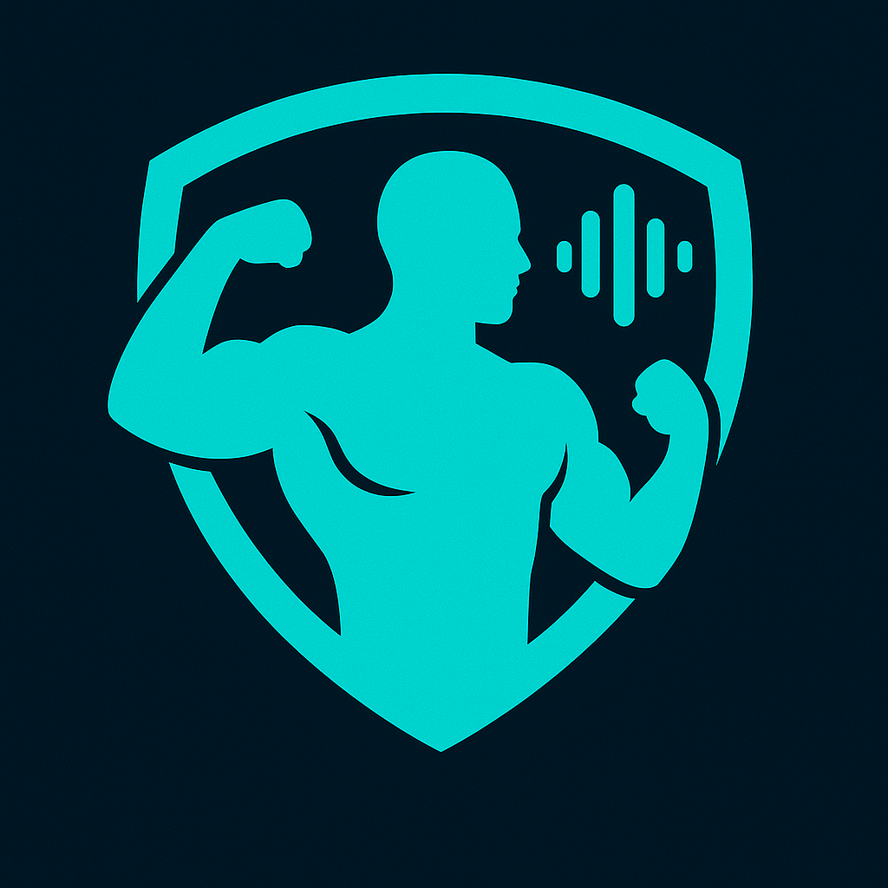

# ⚡ UltimateFit – AI-Powered Fitness Web App with a Smart AI Voice Coach for Personalized Training! 🚀

<div align="center">



**Your AI Fitness Trainer for Personalized Workouts & Diet Plans**

[](https://nextjs.org/)
[](https://reactjs.org/)
[](https://www.typescriptlang.org/)
[](https://www.mongodb.com/)
[](https://clerk.com/)
[](https://openai.com/)

</div>

## 🏋️‍♂️ About UltimateFit

UltimateFit is an innovative AI-powered fitness application that revolutionizes personal training by providing customized workout routines and diet plans through voice interaction with an intelligent AI coach. The platform combines cutting-edge AI technology with comprehensive fitness expertise to deliver personalized fitness solutions tailored to individual goals, equipment availability, and fitness levels.

### ✨ Key Features

- **🤖 AI Voice Coach**: Interactive voice conversations with UltimateFit AI for personalized program generation
- **🎯 Muscle Selection**: Interactive body diagram for precise muscle group targeting
- **🏋️ Equipment-Based Workouts**: Customized routines based on available equipment (bodyweight, dumbbells, gym equipment, etc.)
- **📱 Progressive Workflow**: Step-by-step program creation with muscle selection → equipment selection → exercise generation
- **🍎 Personalized Diet Plans**: AI-generated nutrition plans matching fitness goals and dietary restrictions
- **📊 User Profiles**: Comprehensive user management with program history and tracking
- **🎥 Video Tutorials**: YouTube-embedded exercise demonstrations for proper form guidance
- **🔐 Secure Authentication**: Robust user authentication and session management

## 🛠️ Technologies & Tools

### Frontend

- **Next.js 15.5.2** - React framework with App Router
- **React 19.1.0** - Modern React with concurrent features
- **TypeScript 5.9.2** - Type-safe development
- **Tailwind CSS 4.1.14** - Utility-first CSS framework
- **Radix UI** - Accessible component primitives
- **Lucide React** - Beautiful icons
- **Shadcn** - Additional UI components

### Backend & AI

- **OpenAI GPT-4/5** - Advanced AI for workout and diet plan generation
- **Google Gemini 2.5 Flash** - Alternative AI model for enhanced performance
- **Vapi AI** - Voice AI integration for conversational interface
- **Next.js API Routes** - Serverless backend functions

### Database & Authentication

- **MongoDB 8.18.1** - NoSQL database for user data and fitness plans
- **Mongoose** - MongoDB object modeling
- **Clerk** - Complete authentication and user management

### Development Tools

- **ESLint** - Code linting and quality assurance
- **PostCSS** - CSS processing
- **Autoprefixer** - CSS vendor prefixing
- **SVGR** - SVG to React component conversion


## 📁 Project Structure

```
muscleselector/
├── src/
│   ├── app/                    # Next.js App Router
│   │   ├── (auth)/            # Authentication pages
│   │   ├── api/               # API routes
│   │   │   ├── clerk-webhook/ # Clerk webhook handler
│   │   │   ├── generate-exercises/ # Exercise generation API
│   │   │   ├── generate-program/   # Program generation API
│   │   │   └── get-user-plan/     # User plan retrieval API
│   │   ├── generate-program/  # Program generation page
│   │   ├── profile/           # User profile page
│   │   ├── globals.css        # Global styles
│   │   ├── layout.tsx         # Root layout
│   │   └── page.tsx           # Home page
│   ├── components/            # React components
│   │   ├── ui/               # Reusable UI components
│   │   ├── CornerElements.tsx
│   │   ├── EquipmentSelector.tsx
│   │   ├── Exercises.tsx
│   │   ├── MuscleSelector.tsx
│   │   ├── Stepper.tsx
│   │   ├── TerminalOverlay.tsx
│   │   └── UserPrograms.tsx
│   ├── lib/                   # Utility libraries
│   │   ├── dbConnect.ts       # MongoDB connection
│   │   ├── utils.ts           # General utilities
│   │   └── vapi.ts            # Vapi AI configuration
│   ├── models/                # Database models
│   │   ├── Plan.ts            # Fitness plan schema
│   │   └── User.ts            # User schema
│   └── middleware.ts          # Next.js middleware
├── public/                    # Static assets
├── components.json            # UI component configuration
└── package.json               # Dependencies and scripts
```

## 🎯 Core Features Explained

### 1. Interactive Muscle Selection

- **Interactive Body Diagram**: SVG-based human anatomy visualization
- **Multi-muscle Selection**: Select multiple muscle groups for comprehensive workouts
- **Visual Feedback**: Real-time color changes and hover effects
- **Muscle Groups**: Chest, shoulders, biceps, triceps, back, abs, obliques, quads, hamstrings, glutes, calves, forearms, traps

### 2. Equipment-Based Workout Generation

- **Equipment Selection**: Choose from bodyweight, dumbbells, barbells, resistance bands, gym equipment
- **Smart Substitutions**: AI suggests equipment alternatives when needed
- **Equipment-Specific Routines**: Workouts tailored to available equipment

### 3. AI Voice Coach Integration

- **Vapi AI Integration**: Real-time voice conversation capabilities
- **Natural Language Processing**: Understands user preferences and goals
- **Personalized Recommendations**: AI generates custom workout and diet plans
- **Voice-to-Text**: Real-time transcription of conversations

### 4. Comprehensive Program Generation

- **Workout Plans**:
  - Structured weekly schedules
  - Exercise-specific routines with sets, reps, and descriptions
  - Difficulty levels and muscle targeting
  - YouTube video tutorials for each exercise
- **Diet Plans**:
  - Calorie-calculated meal plans
  - Dietary restriction considerations
  - Meal timing and portion guidance

### 5. User Management & Profiles

- **Clerk Authentication**: Secure user registration and login
- **Profile Management**: User information and preferences
- **Program History**: Track and manage multiple fitness programs
- **Progress Tracking**: Monitor fitness journey over time

## 🔧 API Endpoints

### Exercise Generation

- **POST** `/api/generate-exercises`
  - Generates exercise recommendations based on selected muscles and equipment
  - Returns structured JSON with exercise details and YouTube tutorials

### Program Generation

- **POST** `/api/generate-program`
  - Creates complete fitness programs (workout + diet plans)
  - Integrates OpenAI GPT-4/5 and Google Gemini AI
  - Saves programs to MongoDB

### User Plan Management

- **GET** `/api/get-user-plan`
  - Retrieves user's active fitness programs
  - Returns program history and details

### Authentication Webhook

- **POST** `/api/clerk-webhook`
  - Handles Clerk authentication events
  - Manages user data synchronization

## 🎨 Design System

### Color Palette

- **Primary**: Neon Teal (#00f5d4) - Main accent color
- **Secondary**: Aqua Blue (#06b6d4) - Supporting elements
- **Background**: Dark (#0b1416) - Main background
- **Text**: Light Teal (#e0f2f1) - Primary text color
- **Accent**: Cyan Glow (#2dd4bf) - Highlight elements

### Typography

- **Primary Font**: Geist Sans - Clean, modern sans-serif
- **Monospace**: Geist Mono - Code and technical content

### UI Components

- **Cards**: Elevated surfaces with subtle borders
- **Buttons**: Rounded corners with hover effects
- **Forms**: Consistent styling with validation states
- **Animations**: Smooth transitions and loading states


## 🚀 Deployment

UltimateFit is **deployed on [Vercel](https://vercel.com)** for seamless performance, scalability, and CI/CD integration.
The backend APIs, authentication, and AI endpoints are hosted within the same Next.js environment for unified deployment and optimized response times.


## 🏁 Ending Notes

UltimateFit redefines digital fitness by merging **AI intelligence**, **voice interactivity**, and **personalized coaching** — all in one intuitive platform.
Start your transformation today and experience the future of fitness powered by AI.

👉 **Visit the website:** [https://ultimatefit.vercel.app](https://ultimatefit.vercel.app)

---
